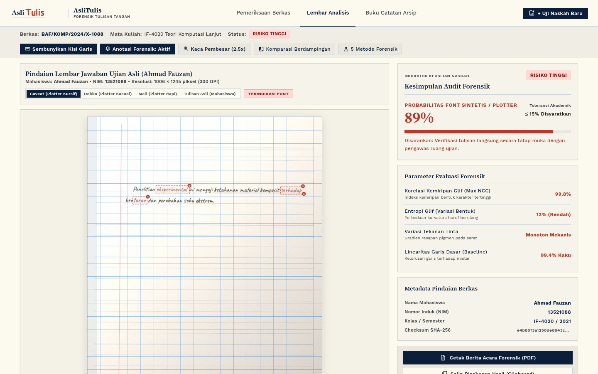
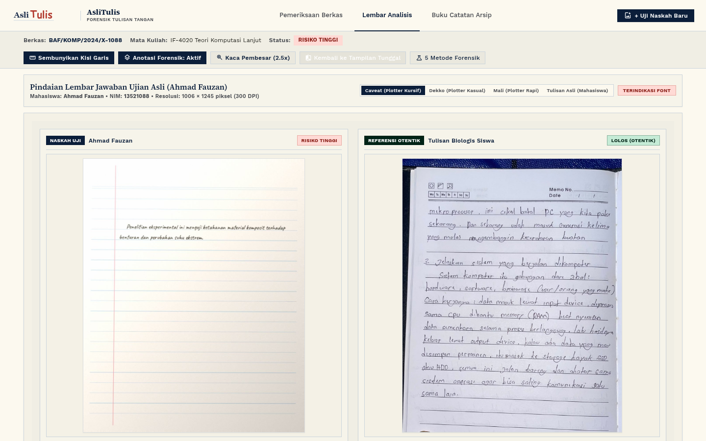

# AsliTulis

AsliTulis adalah sistem audit forensik berbasis computer vision dan machine learning untuk mendeteksi manipulasi tulisan tangan pada tugas atau lembar ujian mahasiswa. Sistem ini membedakan naskah tulisan tangan manusia asli dari naskah sintetis yang dihasilkan oleh font digital berbasis AI atau alat mekanis pen-plotter.

## Latar Belakang

Generator font tulisan tangan dan mesin pen-plotter modern dapat mereproduksi teks yang sekilas tampak seperti tulisan tangan manusia. Walaupun demikian, naskah sintetis tetap meninggalkan pola fisik yang dapat diukur secara komputasi:
- Pengulangan karakter (alograf) dengan geometri vektor identik pada kata yang berbeda.
- Ketebalan goresan pena yang seragam tanpa variasi tekanan dinamis.
- Deviasi garis dasar (baseline) yang terlalu kaku terhadap garis mistar kertas.
- Distribusi warna pigmen tinta yang rata tanpa gradien resapan serat kertas alami.

AsliTulis mengekstrak parameter-parameter tersebut dari citra resolusi tinggi, lalu mengevaluasinya menggunakan aturan replikasi glif dan model Random Forest.

## Metodologi Deteksi

### 1. Pra-pemrosesan Citra
- Estimasi latar belakang adaptif: Menggunakan operasi morfologi dilasi untuk memisahkan goresan tinta dari variasi pencahayaan, bayangan foto, dan tekstur kertas.
- Eliminasi elemen cetak: Memotong area header atas (12%) untuk menghindari logo atau kotak tanggal buku, serta mendeteksi dan menghapus garis margin vertikal merah.

### 2. Ekstraksi Fitur Forensik
Sistem mengekstrak 7 parameter utama:
- `max_sim`: Nilai korelasi tertinggi (Normalized Cross Correlation) antar-pasangan glif terpisah. Pada tulisan manusia nilainya berada di bawah 0.925, sedangkan font sintetis mencapai 0.940 hingga 0.995.
- `clone_ratio`: Proporsi glif pada naskah yang memiliki pasangan kembar dengan korelasi tinggi (NCC >= 0.93).
- `cluster_3plus_count`: Jumlah kelompok karakter identik yang berulang 3 kali atau lebih lintas baris.
- `stroke_cv`: Koefisien variasi ketebalan goresan pena berdasarkan Euclidean Distance Transform sepanjang sumbu skeleton goresan.
- `baseline_res_std`: Standar deviasi residu penempatan huruf terhadap kurva garis mistar buku bergaris.
- `height_cv`: Entropi variasi tinggi karakter untuk mengukur fluktuasi biologis tangan manusia.
- `ink_std`: Standar deviasi nilai warna piksel tinta untuk menilai gradien serapan serat kertas dibanding warna solid rendering komputer.

### 3. Logika Klasifikasi Dual-Layer
1. Lapisan Aturan Vektor (Hard Clone Law): Naskah langsung ditandai sintetis apabila ditemukan pengulangan karakter yang secara fisik tidak mungkin dihasilkan motorik manusia (`max_sim >= 0.950`, atau kombinasi `clone_ratio >= 0.035` dan `max_sim >= 0.930`, atau `cluster_3plus_count >= 1`).
2. Lapisan Machine Learning: Untuk teks bersambung (kursif) atau teks pendek, model Random Forest mengevaluasi vektor fitur secara multivariat untuk menentukan probabilitas keaslian.

## Hasil Pengujian dan Benchmark

Evaluasi dilakukan terhadap seluruh dataset proyek tanpa sampling:

| Kategori Data | Jumlah Sampel | Prediksi Sintetis | Prediksi Otentik | Akurasi |
| :--- | :---: | :---: | :---: | :---: |
| Data Sintetis (43 variasi font) | 350 | 350 | 0 | 100.0% |
| Data Tulisan Tangan Asli (Mahasiswa & IAM) | 181 | 0 | 181 | 100.0% |

- Stratified 5-Fold Cross Validation: Akurasi 99.44%, ROC-AUC 0.9999.
- 0 False Positives pada data asli mahasiswa.
- 0 False Negatives pada data sintetis font.

## Fitur Aplikasi

- Meja Periksa: Input berkas berbasis drag-and-drop dengan dukungan multi-foto dan arsip ZIP satu kelas.
- Lembar Analisis: Menampilkan citra dokumen terpusat lengkap dengan penanda pin glif kembar, baki legenda interaktif, overlay kisi mistar, dan kaca pembesar 2.5x.
- Komparasi Berdampingan: Membandingkan naskah uji terhadap spesimen referensi secara berdampingan dalam mode 2 kolom layar penuh.
- Parameter Terhitung: Menampilkan nilai pengukuran nyata (Kemiripan Glif, Entropi Bentuk, Tekanan Tinta, Linearitas Garis Dasar).
- Buku Catatan Arsip: Tabel audit riwayat pengujian dengan pencarian teks dan filter status.
- Rekapitulasi CSV: Ekspor hasil audit kelas dan buku catatan arsip ke format CSV berstandar SIAKAD.
- Berita Acara PDF: Format laporan resmi siap cetak tanpa menyertakan tombol navigasi UI.

## Tampilan Antarmuka

### Lembar Analisis Forensik (Pemeriksaan Tunggal)
Visualisasi naskah pindaian terpusat dengan penandaan glif kembar, baki legenda interaktif, garis dasar mistar, dan parameter audit forensik.



### Komparasi Berdampingan (Dual-Specimen Comparator)
Perbandingan naskah uji terhadap spesimen referensi secara berdampingan dalam mode 2 kolom layar penuh untuk memvalidasi perbedaan motorik biologis vs cetakan mekanis.



## Struktur Direktori

```text
AsliTulis/
├── backend/
│   ├── app/
│   │   ├── features.py             # Ekstraksi fitur visual dan pemrosesan citra
│   │   └── main.py                 # API FastAPI dan static file serving
│   ├── data/
│   │   ├── download_fonts.py       # Pengunduh font TrueType Google Fonts
│   │   ├── download_real_data.py   # Script ekstraksi sampel tulisan asli IAM
│   │   ├── generate_fake.py        # Generator citra naskah sintetis
│   │   ├── sentences.json          # Korpus teks Bahasa Indonesia
│   │   ├── real/                   # Dataset naskah asli manusia (181 citra)
│   │   ├── synthetic/              # Dataset naskah font sintetis (350 citra)
│   │   └── train.py                # Pipeline pelatihan model Random Forest
│   └── models/
│       └── classifier.joblib       # Model biner terkompresi
├── docs/
│   └── screenshots/                # Dokumentasi visual antarmuka sistem
├── frontend/
│   ├── assets/                     # Sampel pengujian dan aset gambar
│   ├── css/
│   │   └── style.css               # Desain antarmuka konsol
│   ├── js/
│   │   └── app.js                  # Logika interaktif antarmuka
│   └── index.html                  # Halaman utama aplikasi
├── requirements.txt
└── README.md
```

## Panduan Instalasi dan Menjalankan Sistem

### Prasyarat
- Python 3.10 atau versi yang lebih baru
- Chromium atau Google Chrome (untuk uji end-to-end)

### Instalasi
```bash
# Clone repositori
git clone https://github.com/DarulQutni-Q/AsliTulis.git
cd AsliTulis

# Buat virtual environment
python3 -m venv .venv
source .venv/bin/activate

# Pasang dependensi
pip install -r requirements.txt
```

### Menjalankan Server
```bash
./.venv/bin/uvicorn backend.app.main:app --host 0.0.0.0 --port 8000
```
Buka browser pada alamat `http://localhost:8000`.

### Menjalankan Pengujian

1. Uji Akurasi Model (350 data fake dan 181 data real):
```bash
./.venv/bin/python tests/test_model_accuracy.py
```

2. Uji End-to-End Browser (Playwright):
```bash
./.venv/bin/python tests/test_full_app_e2e.py
```

## Spesifikasi API

### POST `/api/classify`
Menerima berkas citra naskah dan mengembalikan hasil evaluasi forensik.

- Request: `multipart/form-data` dengan field `file` (JPG, PNG, WEBP).
- Response contoh:
```json
{
  "label": "suspect",
  "probability": 99,
  "verdict_type": "suspect",
  "status_label": "TERINDIKASI SINTETIS",
  "verdict_text": "Terindikasi Sintetis / Pen-Plotter (Font Identik Berulang)",
  "recommendation": "Peringatan: Terdeteksi glif berulang identik dengan kemiripan hingga 99.1%...",
  "metrics": {
    "glyph_similarity": "99.1%",
    "entropy": "20.5% (Variatif)",
    "pressure": "Dinamis Alami (CV 0.39)",
    "baseline": "68.8% Organik"
  },
  "top_pairs_count": 3
}
```

## Lisensi

Proyek ini menggunakan lisensi MIT. Lihat file `LICENSE` untuk informasi selengkapnya. Font yang digunakan dalam dataset sintetis bersumber dari Google Fonts dengan lisensi SIL Open Font License (OFL 1.1) dan Apache License 2.0.
